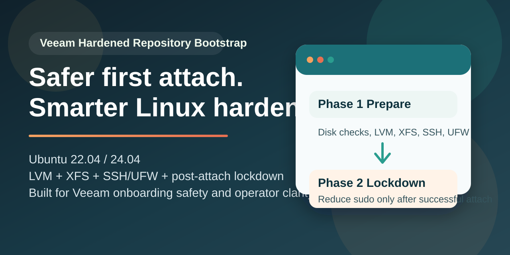
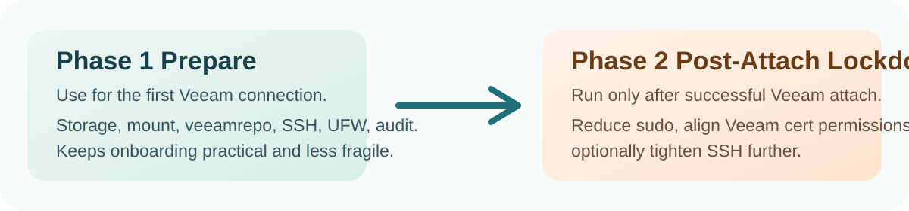

<p align="center">
  
</p>

# Veeam Hardened Repository Bootstrap for Ubuntu 22.04 and 24.04

<p align="center">
  <strong>Safer Bash bootstrap for Veeam Hardened Repository deployments on Ubuntu.</strong><br>
  Storage preparation, SSH and UFW hardening, Veeam onboarding safety, and post-attach lockdown.
</p>

<p align="center">
  
  
  
  
</p>

This repository provides a Bash script to prepare an Ubuntu `22.04 LTS` or `24.04 LTS` server as a `Veeam Hardened Repository` with a safer, operator-friendly workflow for Veeam Backup & Replication.

It is aimed at system administrators who need to deploy a Linux hardened repository without turning the first Veeam connection into a troubleshooting exercise. The script focuses on practical automation for `veeamrepo`, LVM, XFS, SSH hardening, UFW, logging, and controlled privilege reduction after the initial attach.

<p align="center">
  
</p>

The workflow is intentionally split into two phases:

1. `prepare`
Prepares storage, networking, SSH, and the `veeamrepo` account for the first Veeam connection.

2. `post-attach-lockdown`
Reduces privileges only after the first successful Veeam onboarding.

## Table of Contents

- [Why This Repository Exists](#why-this-repository-exists)
- [At a Glance](#at-a-glance)
- [What This Project Does](#what-this-project-does)
- [Key Benefits](#key-benefits)
- [Who This Is For](#who-this-is-for)
- [Supported Systems](#supported-systems)
- [Repository Structure](#repository-structure)
- [Quick Start](#quick-start)
- [Feature Snapshot](#feature-snapshot)
- [Multiple Networks](#multiple-networks)
- [Before Using `--force-wipe yes`](#before-using---force-wipe-yes)
- [Documentation](#documentation)
- [FAQ](#faq)
- [Project Status](#project-status)
- [Important Notes](#important-notes)

## Why This Repository Exists

Many hardened repository scripts are either too aggressive or too opaque:

- they assume the repository disk is always `/dev/sdb`
- they remove privileges too early
- they overwrite system configuration too aggressively
- they do not help the operator choose the right parameters

This project aims for the opposite:

- safety first
- guided behavior where possible
- dry-run and precheck support
- practical operational documentation
- a GitHub repository that is understandable even for users with limited Linux experience

## At a Glance

- purpose: bootstrap a Veeam Hardened Repository on Ubuntu with a safer operator workflow
- storage stack: dedicated disk, GPT or direct PV, LVM, XFS
- onboarding model: keeps `veeamrepo` usable for first attach, then locks it down
- hardening scope: SSH, UFW, logging, audit, sysctl, update automation
- execution modes: interactive, non-interactive, `--dry-run`, `--precheck-only`

## What This Project Does

The script:

- prepares the repository disk with LVM and XFS
- configures persistent mount and repository path
- creates or prepares the `veeamrepo` user
- keeps temporary `sudo` access during the first Veeam onboarding
- configures SSH, UFW, logging, audit, and baseline hardening
- applies the final user lock-down only after the first attach

## Key Benefits

- safer first onboarding for `veeamrepo`
- no `.env` file requirement
- interactive mode for operators with limited Linux familiarity
- non-interactive mode for repeatable deployments
- `dry-run` and `precheck-only` support before making changes
- repository-focused documentation with practical debug commands

## Who This Is For

- sysadmins deploying Veeam Hardened Repositories on Ubuntu
- operators who know Veeam better than Linux and want guard rails
- teams that want a reusable Bash script instead of a one-off manual checklist
- administrators who want a clearer migration path from first attach to reduced access

## What It Does Not Do

The script does not:

- make destructive guesses when disk selection is ambiguous
- remove `veeamrepo` privileges too early
- require `.env` files or external configuration files

## Supported Systems

- Ubuntu `22.04 LTS`
- Ubuntu `24.04 LTS`

## Repository Structure

- [veeam_hardened_repository_safe.sh](./veeam_hardened_repository_safe.sh)
- [docs/OPERATIONAL_GUIDE.md](./docs/OPERATIONAL_GUIDE.md)
- [docs/FAQ.md](./docs/FAQ.md)
- [CHANGELOG.md](./CHANGELOG.md)
- [CONTRIBUTING.md](./CONTRIBUTING.md)
- [PUBLISHING_CHECKLIST.md](./PUBLISHING_CHECKLIST.md)
- [SUPPORT.md](./SUPPORT.md)
- [SECURITY.md](./SECURITY.md)
- [CODE_OF_CONDUCT.md](./CODE_OF_CONDUCT.md)

## Quick Start

### 1. Show help

```bash
bash veeam_hardened_repository_safe.sh --help
```

### 2. Simulate the run

```bash
sudo bash veeam_hardened_repository_safe.sh \
  --dry-run \
  --non-interactive \
  --phase prepare \
  --disk /dev/sdb \
  --mount /veeamrepo \
  --repo-dir /veeamrepo/backup \
  --veeam-user veeamrepo \
  --veeam-group veeamrepo \
  --ssh-net 192.168.10.0/24 \
  --veeam-net 192.168.10.0/24
```

### 3. Run prechecks

```bash
sudo bash veeam_hardened_repository_safe.sh \
  --precheck-only \
  --non-interactive \
  --phase prepare \
  --disk /dev/sdb \
  --mount /veeamrepo \
  --repo-dir /veeamrepo/backup \
  --veeam-user veeamrepo \
  --veeam-group veeamrepo \
  --ssh-net 192.168.10.0/24 \
  --veeam-net 192.168.10.0/24
```

### 4. Run the preparation phase

```bash
sudo bash veeam_hardened_repository_safe.sh \
  --non-interactive \
  --phase prepare \
  --disk /dev/sdb \
  --mount /veeamrepo \
  --repo-dir /veeamrepo/backup \
  --veeam-user veeamrepo \
  --veeam-group veeamrepo \
  --ssh-net 192.168.10.0/24 \
  --veeam-net 192.168.10.0/24
```

### 5. After Veeam onboarding, apply the lock-down

```bash
sudo bash veeam_hardened_repository_safe.sh \
  --phase post-attach-lockdown \
  --veeam-user veeamrepo \
  --veeam-group veeamrepo
```

## Feature Snapshot

| Area | Included |
| --- | --- |
| Veeam onboarding safety | Keeps `veeamrepo` usable during first attach |
| Storage preparation | Dedicated disk checks, LVM creation, XFS formatting, persistent mount |
| Hardening baseline | SSH, UFW, sudo logging, auditd, sysctl, updates |
| Operator experience | Interactive prompts, summaries, dry-run, precheck-only |
| Rerun behavior | Safer validation and guard rails for repeated execution |
| Post-attach lockdown | Reduced sudo, optional SSH restriction, certificate permission alignment |

## Multiple Networks

If you need to allow multiple networks, use a single argument with comma-separated values.

Correct:

```bash
--ssh-net 192.168.10.0/24,192.168.20.0/24
--veeam-net 10.10.50.0/24,10.10.60.0/24
```

Incorrect:

```bash
--ssh-net 192.168.10.0/24 --ssh-net 192.168.20.0/24
```

In that case only the last value is kept.

## Before Using `--force-wipe yes`

Always check:

```bash
lsblk -f /dev/sdb
wipefs -n /dev/sdb
findmnt /
```

If you are not fully sure about the disk, stop.

## Documentation

For operational use:

- [docs/OPERATIONAL_GUIDE.md](./docs/OPERATIONAL_GUIDE.md)
- [docs/FAQ.md](./docs/FAQ.md)
- [SUPPORT.md](./SUPPORT.md)
- [SECURITY.md](./SECURITY.md)

## FAQ

Common operator questions are documented here:

- [docs/FAQ.md](./docs/FAQ.md)

## Project Status

The project is ready for operational use and further iteration.

If you plan to distribute or reuse it widely, add an explicit `LICENSE` file.

## GitHub Publishing

Use the checklist:

- [PUBLISHING_CHECKLIST.md](./PUBLISHING_CHECKLIST.md)

## Important Notes

- do not run lock-down before the first successful onboarding
- do not use `--force-wipe yes` without validating the disk first
- always try `dry-run` and `precheck-only` first
